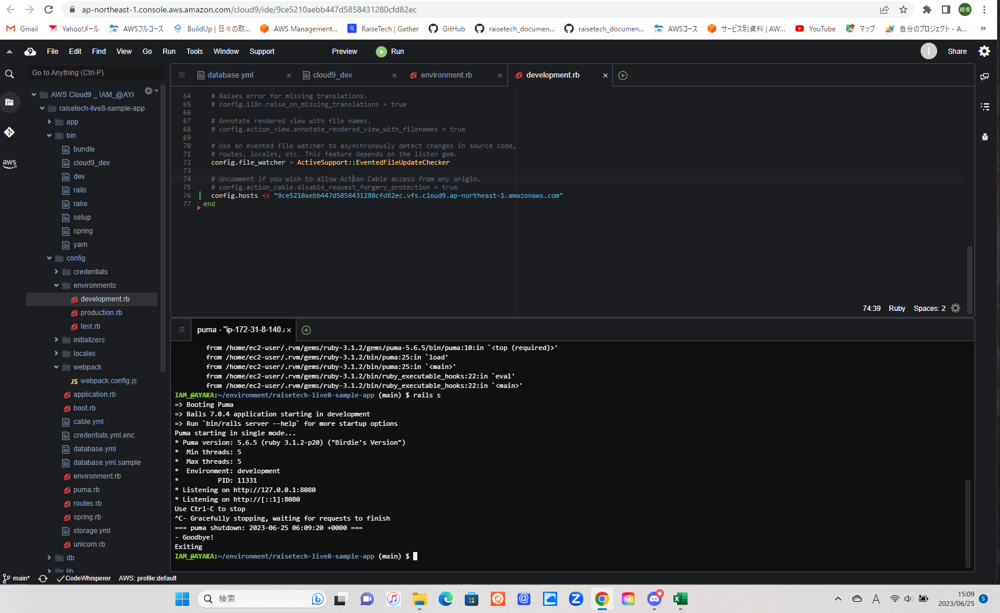
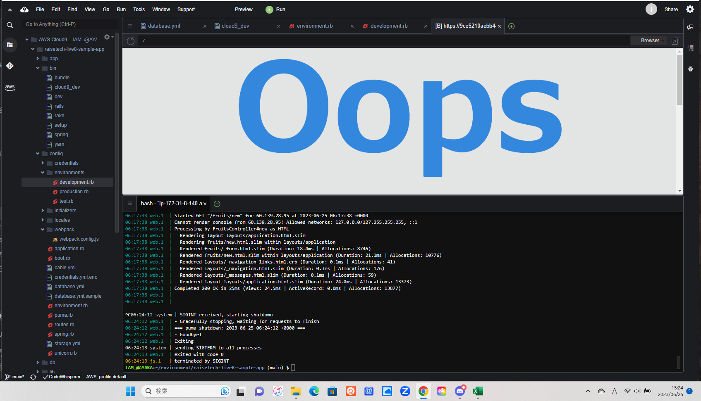
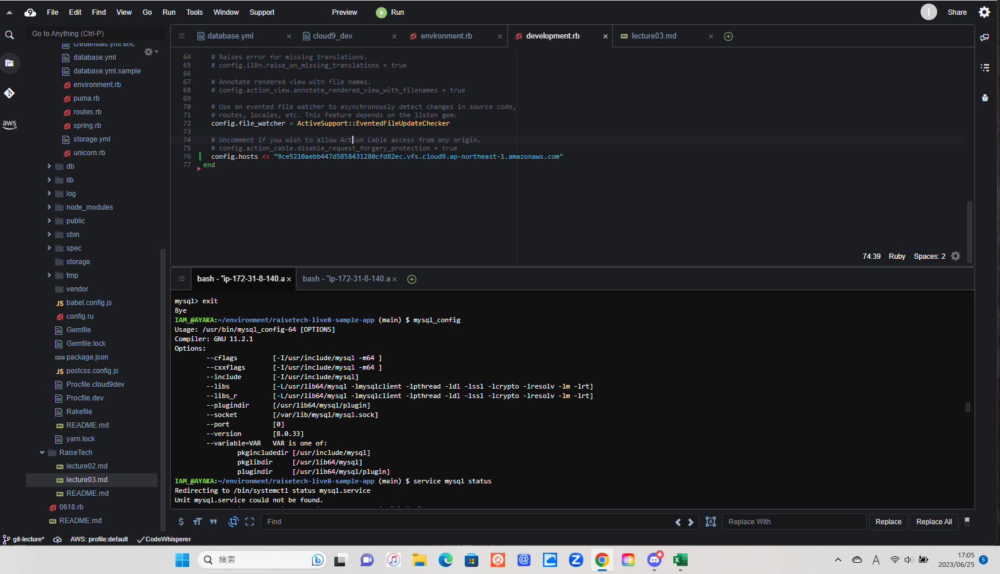
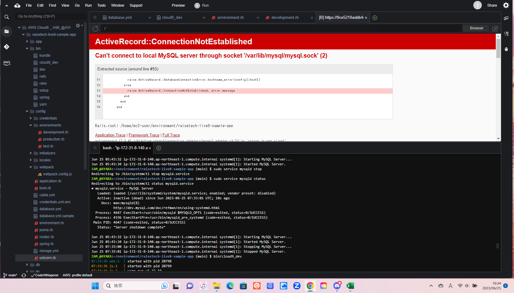
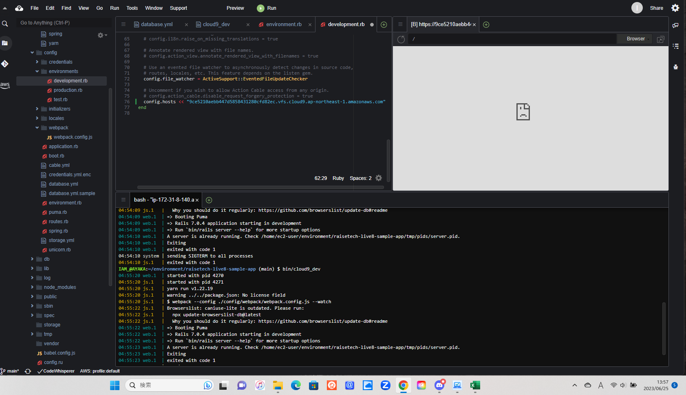
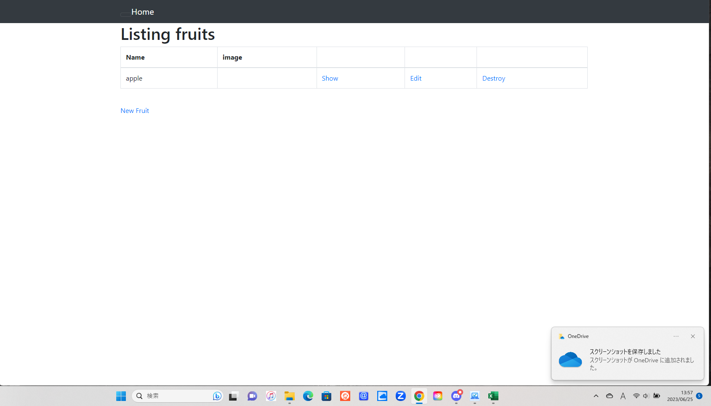

# 第3回課題
1. APサーバーについて
- APサーバーの名前：Puma　
- Pumaのバージョン：5.6.5
- 
- Puma終了した場合：アクセスできない
- 

2. DBサーバーについて
- DBサーバーの名前：MySQL
- MySQLのバージョン：8.0.33
- 
- BDサーバー終了時：アクセスできない
- 
- 覚えておきたいコマンド：sudo service mysqld start、sudo service mysqld stop、sudo service mysqld status

3. Railsの構成管理ツールの名前：Bundler
- GemとBundlerについてはもう一度復習して理解を深めたい

4. 通常時起動確認
- 
- 

5. 学んだこと
- rvmとBundlerのインストール
- socketを修正→mysql_configで確認し修正
- パーミッションの変更→特にsudoとchmodはもう一度調べてよく理解したい
- コマンドが失敗していることがわかっても、エラーの場所が最初よくわからなかった
- また、記載されたエラーが何を示しているのか確認するのに手間取った
- 今回の課題で学んだ部分は何度か復習してしっかり理解できるようにしたい