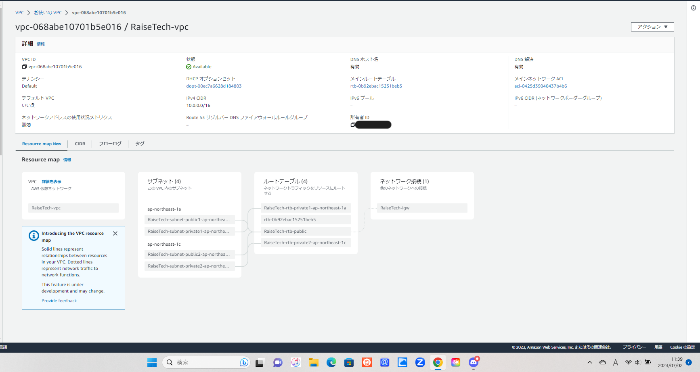
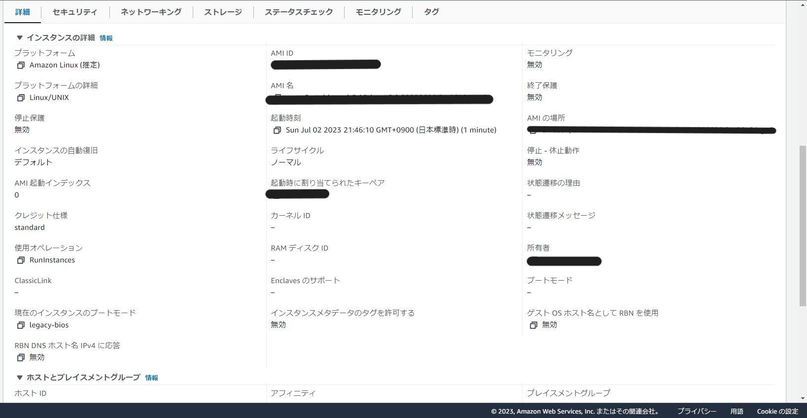
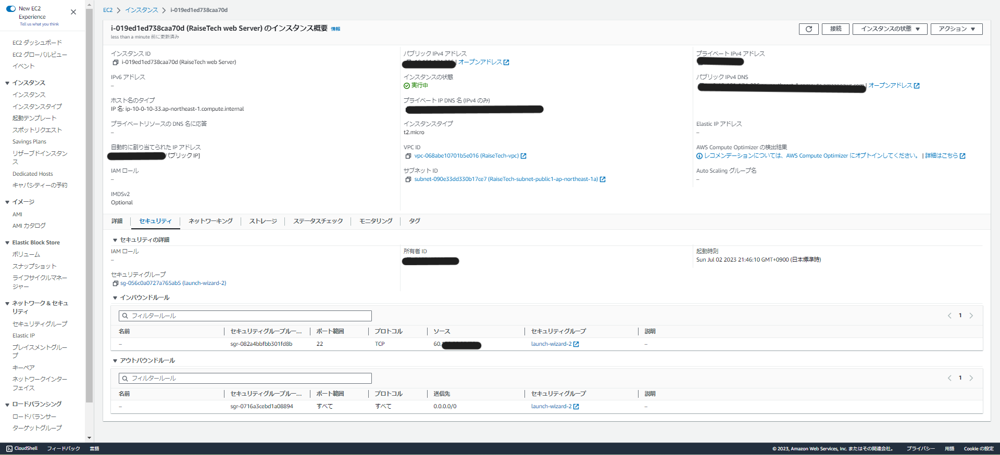
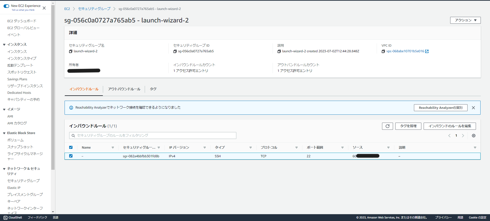
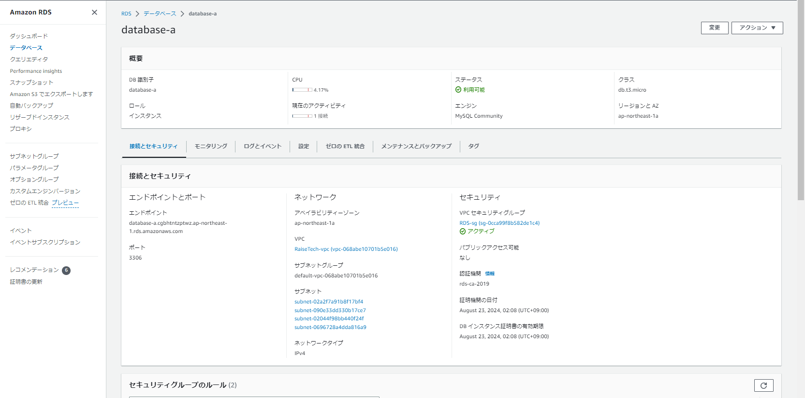
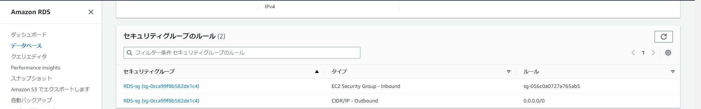
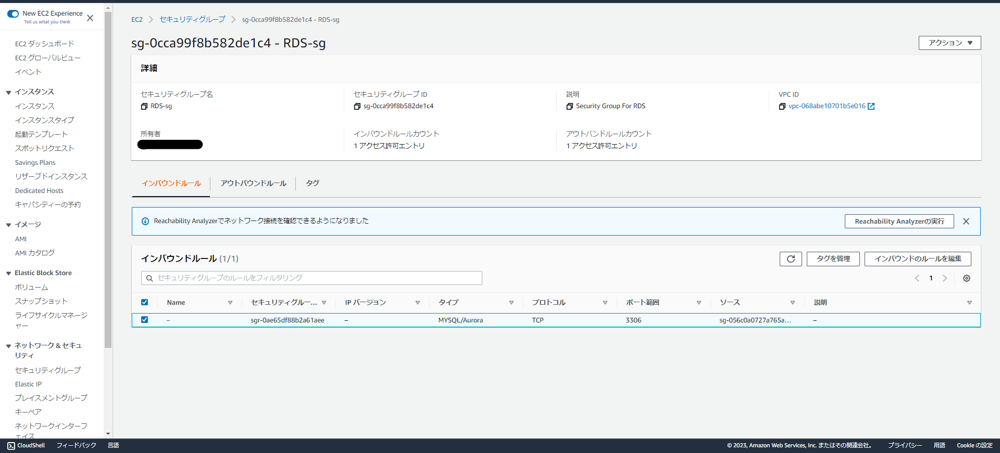
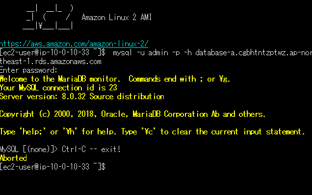

# 第4回講義

1. VPC、サブネット構築
- 
- CIDRブロックは後から増やせないため多めの見積もりをしておく
- IP6とテナンシー（専用ハードウェアを使用するかどうか）はあまり使用しない
- VPCエンドポイントを使用するとVPC外のサービスにインターネットではなくAWS内のネットワークで接続可能に（今回は設定なし）
- DNSオプションあり（DNSホスト名を有効化・DNS解決を有効化…もう一度よく確認して理解を深める）

2. EC2作成
- 
- 
- 
- セキュリティグループに、今自分がインターネットに接続しているIPアドレスを設定して対応。

3. RDS作成
- 
- 
- 
- セキュリティグループにEC2のセキュリティグループを設定して対応。

4. EC2からRDSへ接続
- 
- WindowsのPCを利用中のため、TeraTermから接続。MySQLのインストールと'mysql -u admin -p -h RDSのエンドポイント'のコマンドで接続。

5. 今回学んだこと、感想など
- セキュリティーグループ…接続のルールを設定。セキュリティグループの設定の設定IPアドレスがわからず苦戦。
- IPアドレスには種類がたくさんあるんだな…と実感。ネットワークにつながっているIPアドレスを調べて繋がったときはとてもうれしい気持ちに。
- ネットワークや通信関連の部分については今回学んだが、引き続き理解を深めていくように勉強を続けたい。
- 最初に講義を見たときにはちんぷんかんぷんだった部分も、少しずつの歩みではあるがだんだんわかるようになってきたように感じる。
- 引き続き課題を進めながら、時折過去の講義内容を復習しつつ理解を深めていきたい。