# 第5回課題
1. 組み込みサーバーでの起動
- 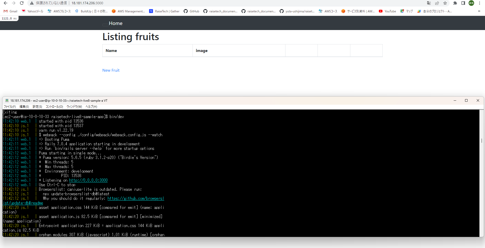
- docker system prune -a

- EBSサイズ拡張　
- ⇒　df -h　⇒lsblk 
- ⇒sudo growpart /dev/xvda 1

- MySQL設定
- mysql --version ⇒MariaDB確認、削除してMySQLをインストール
- 以下を貼り付け
- curl -fsSL https://raw.githubusercontent.com/MasatoshiMizumoto/raisetech_documents/main/aws/scripts/mysql_amazon_linux_2.sh | sh
- mysql -u root -p RDSのエンドポイント
- sudo yum install mysql-devel →railsでMySQLを利用するためのパッケージをインストール
 
- Gitのインストール：git versionでエラーになる場合はsudo yum install gitでインストール
- Gitの初期設定
- git clone
- rvm install
- gpg2 --keyserver hkp://keys.gnupg.net --recv-keys 409B6B1796C275462A1703113804BB82D39DC0E3
- curl -sSL https://get.rvm.io | bash -s stable
- rvm install 3.1.2
- bundle -v からの　gem install bundler -v  2.3.14
- gem install rails -v 7.0.4

- Node インストール
- curl -o- https://raw.githubusercontent.com/nvm-sh/nvm/v0.39.3/install.sh | bash
- . ~/.nvm/nvm.sh
- nvm install 17.9.1
- 確認node -e "console.log('Running Node.js ' + process.version)"
- yarnインストール　npm install --global yarn
- bin/setup
- RDSパスワードの登録とsocketの確認修正、RDSのエンドポイントを追加→viコマンドで入力
- EC2のセキュリティグループ設定でTCP3000（一応8000も）に自分のIPアドレスから接続できるように設定
- bin/dev

2. Nginxのインストール、Unicornでの起動
- Nginx起動確認　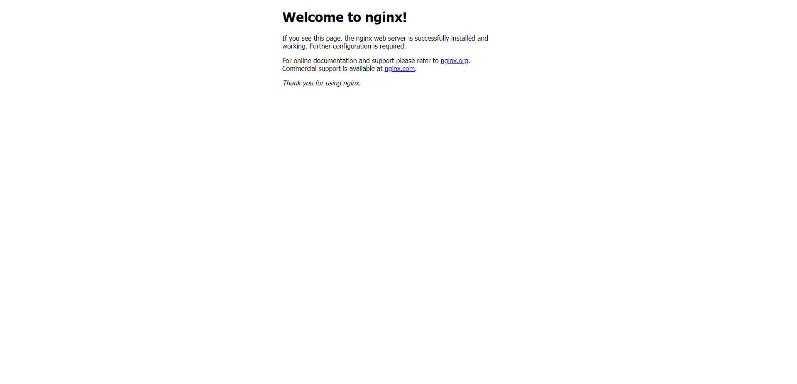
- Nginxインストール：sudo amazon-linux-extras install nginx1 -y
- sudo systemctl start nginx.service
- sudo systemctl status nginx.service
- 接続しないのでいろいろ確認…nginx -V、curl localhost、ps ax | grep nginx、ss -natu | grep LISTEN | grep 80
- セキュリティグループ設定：TCP80を追加→Nginxの接続確認完了
- 一旦Nginxの起動終了：sudo systemctl stop nginx.service

- Unicorn
- Gemfileにgem　’Unicorn’があることを確認した上でbundle install
- sudo vi /etc/nginx/nginx.confでunicorn接続に必要な情報を追加
- bundle exec unicorn_rails -E development -c config/unicorn.rb -D
- sudo systemctl start nginx.service
- 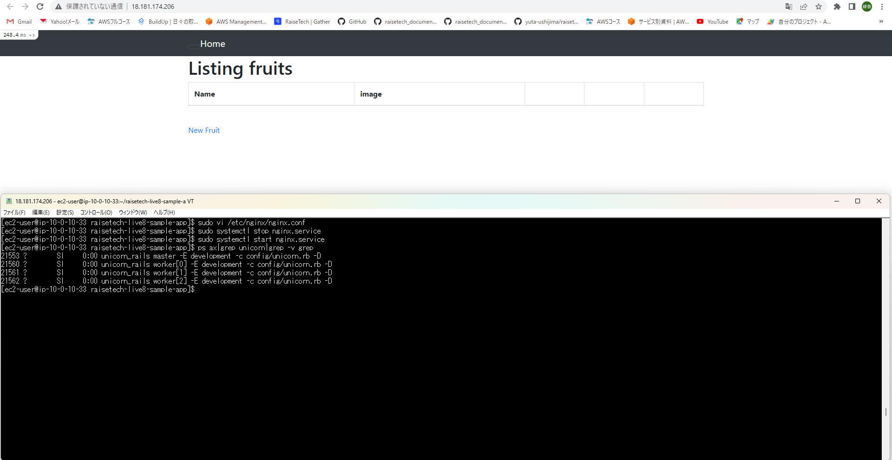
- 止めるときはps aux | grep unicornで調べた番号をkill -9

3. ALB作成
- ターゲットグループの設定　AZを指定
- http 80ポートを指定
- ALB用のセキュリティグループを作成。80ポートに自分のIPアドレスを指定。
- 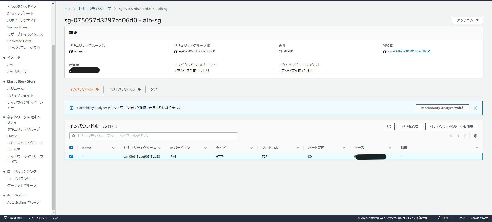
- EC2のセキュリティグループは22ポートと、ALB用のセキュリティグループ設定を設定する。
- 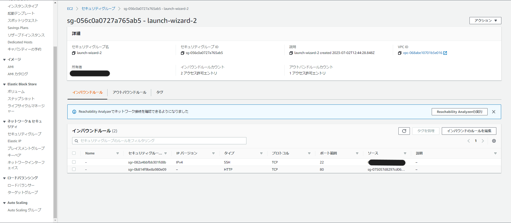
- blocked hostはconfig/environments/development.rbにconfig.hosts.clearを追記。
- 接続確認 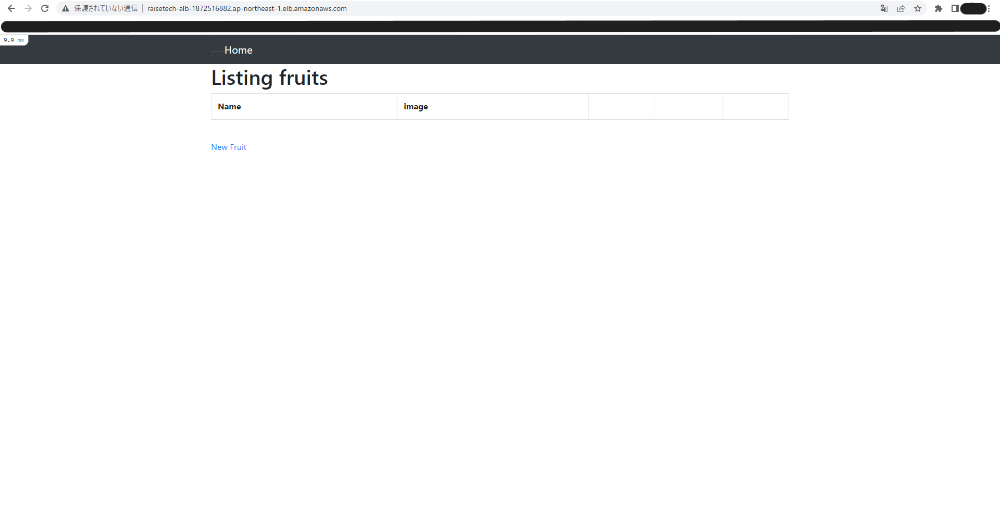
- ヘルスチェック 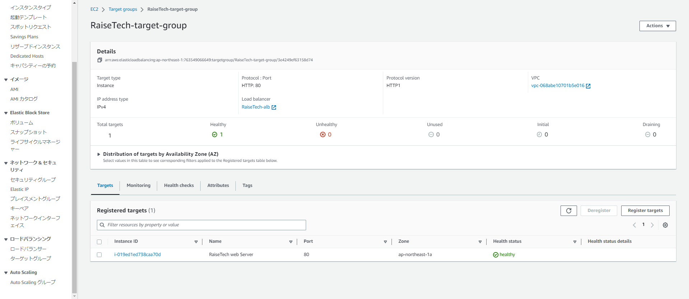

4. S3作成
- S3は画像保存先として利用。
- S3接続の前にアプリで画像が表示されていないことに気づいてimagemagickのインストールへ。
- 参考URL（途中まで参考にしてインストール）[Amazon Linux 2 に ImageMagick 7 をインストールする(PHP)](https://qiita.com/qwe001/items/110bc0a12d56052aeb01)
- インストール後、無事に画像表示できた。 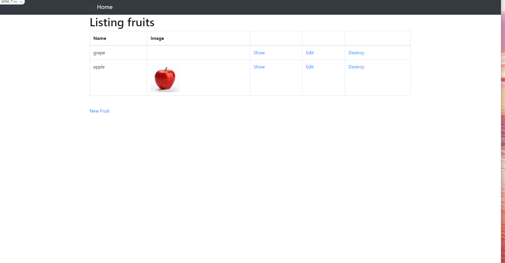
- S3、S3にアクセスできるIAMロール、VPCエンドポイントを作成。
- EC2にIAMロールをアタッチ。バケットポリシーの設定に手間取ったものの、なんとかEC2とS3の接続完了！
- 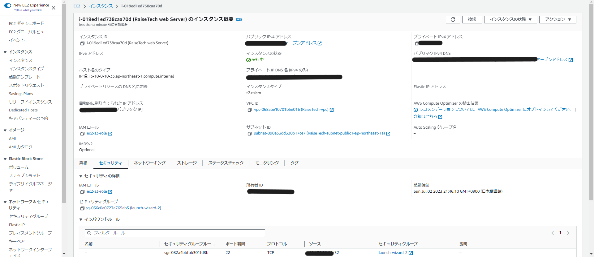
- 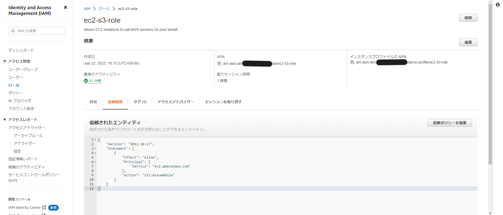
- 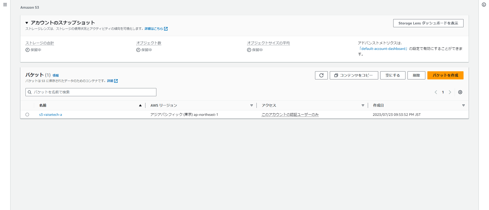
- 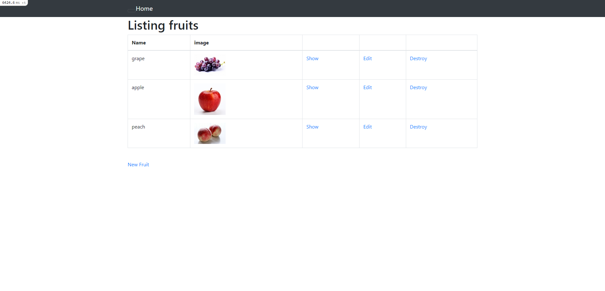
- 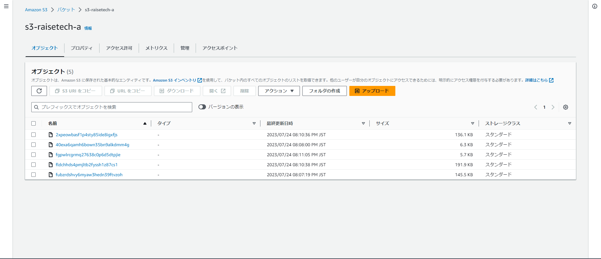
- 参考にしたサイト1[AWS EC2からS3へアクセス(EC2にロールをセット)](https://itsakura.com/aws-ec2-s3-role)
- 参考にしたサイト2[【AWS初心者】EC2からS3にある特定のバケットにアクセスするIAM roleを作成する](https://qiita.com/komazawa/items/988c346274666023d9dd)

5. 構成図作成
- 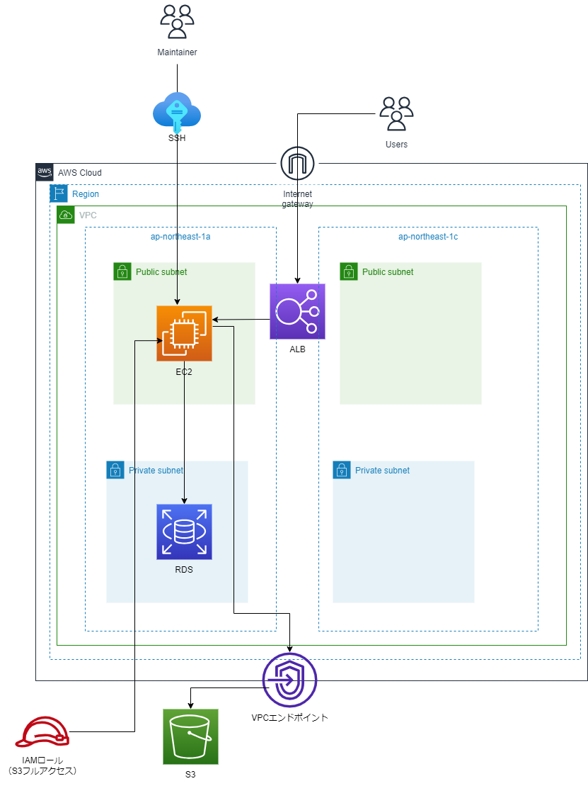

6. 今回の感想
- セキュリティグループ設定、バケットポリシー設定の理解に時間がかかってしまい、なかなか接続できなかった。
- 進めながら調べていく中で、少しずつ理解が深まっていったように感じた。最初のお手上げ状態に比べたら成長できた気がする。