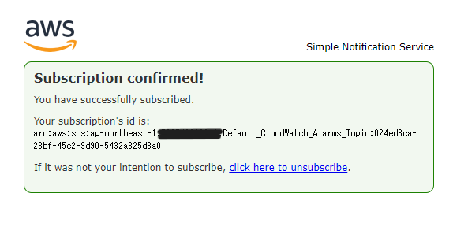

# 第6回課題

## 課題1 cloud Trailの確認
- Cloud Trailはデフォルトでonになっていて、データが90日保存できるとのこと。
- 証跡を作成すると、S3バケットが自動作成される。S3に保存されるデータは90日以上保存でき、証跡と呼ばれる。
- 内容としては以下の3つの項目。2.3.の項目は設定を有効にすることで記録されるようになる。
1. 管理イベント（マネジメントコンソールへのログインやEC2などAWSリソースの作成・変更削除などの操作）
2. データイベント(S3バケット内のデータ操作などAWSリソースへの操作)
3. インサイトイベント(AWSアカウントの操作において普段とは異なる異常な操作)

- 上記画像内のログから3つのイベントを確認。
- イベント1：LookupEvents CloudTrailの内容を確認していた時のログ。
- イベント2：DescribeTargetHealth　下記課題2作業時にヘルスチェックの状態確認をしていた時のログ。
- イベント3：DescribeAlarm　同じく下記課題2作業時にアラーム確認したときのログ。
- JSON形式の記録の見方がいまいちなので、この辺りは勉強していきたいと思った。

## 課題2 Cloud Watchアラーム設定
* unhealthyのアラームを作成。

- なかなか通知メールが来ず、アプリに接続できる状態と接続できない状態とを切り替えることでメール受信完了。
- healthyとunhealthyの判定には結構時間がかかる模様。気長に待つのがよさそう。

## 課題3 見積もりの作成
* これまで作成したリソースの見積もりを作成。対象は下記の通り。  
- VPC、EC2、RDS for MySQL、ELB(ALB)、S3、CloudTrail、CloudWatch
- <https://calculator.aws/#/estimate?id=5a1b7e6b87403a59ccbf3c379f6bd53e3ffc6520>

## 課題4 現在の料金確認

1. 6月請求分を確認
- 第3回課題に取り組んだ際、EBSのサイズ変更の部分がよくわからずにインスタンスタイプを変更してしまったことが要因。
- そのあとすぐに必要なかったことに気づいて元に戻したので、少額請求されている。
2. 参考に7月分も確認
- 現在は無料枠内で運用中。定期的に状況を確認しつつ進めていきたい。

## 今回学んだこと
* ログの重要性について学んだ。今回はCloudTrailの確認をしたけれど、中身がよくわからないと検証も何もできないな…と感じた。
* これからもっと沢山のことを学んでいきたいと思う。