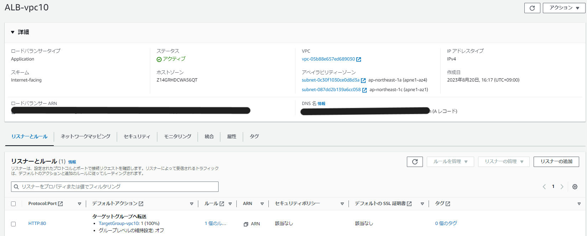
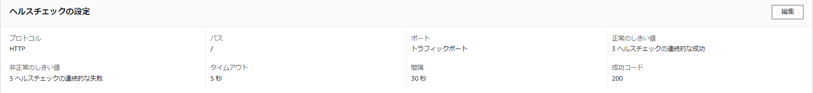

# 第10回課題

## はじめに
* CloudFormationを作成するにあたり、VScodeをインストールして対応。
- VScodeも奥が深そうなので、使いこなせるように色々調べていきたい。
- CloudFomation作業用におすすめされていたVScodeの拡張機能であるYAMLとCloudFormation Linterをインストール。
- 作成時に!Refなどに対しエラーが出るものの、追加設定すると対応できる模様。[VSCodeでAWS CloudFormation をYAMLで書くための個人的ベスト設定](https://qiita.com/yoskeoka/items/6528571a45cd69f93deb)
- 参考資料1 [CloudFormation の参照周りで意識すべきポイント・Tips](https://dev.classmethod.jp/articles/cloudformation-tips-focused-on-refs/)
- 参考資料2 [CloudFormationテンプレート間で値を渡す3つの方法](https://qiita.com/tiibun/items/67aa74cdc17bc0b9812c)
- 参考資料3[CloudFormationを学びたい方へ 個人的学習法・テンプレート書き方まとめ](https://qiita.com/takeITeasy7/items/11cb9bf4dccaaf0d66b2)
- 複数の要素を作るときはこれを使う模様（今回は個別に作ったので必要なかった）　[DependsOn 属性](https://docs.aws.amazon.com/ja_jp/AWSCloudFormation/latest/UserGuide/aws-attribute-dependson.html)
- [Outputs (出力)](https://docs.aws.amazon.com/ja_jp/AWSCloudFormation/latest/UserGuide/outputs-section-structure.html)

## スタック作成結果

## まずはVPCの作成から。
* ネットで調べれば簡単に構文が出てくるので、すぐにできそうではあったが、過去に自分が作成した時のことを思い出しつつ、VPCの設定で必要なものは何だったかを調べながら作業。
- なんとなく設定していたものもあったので、改めて調べながらの作業はなかなか時間がかかった。
- 参考URL1 [AWS::EC2::VPC](https://docs.aws.amazon.com/ja_jp/AWSCloudFormation/latest/UserGuide/aws-resource-ec2-vpc.html#cfn-ec2-vpc-ipv4ipampoolid)
- 参考URL2 [CloudFormationを使ってVPC構築](https://cloud5.jp/cfn_vpc/)
- 参考URL3 [CloudFormation を使用した Amazon VPC の作成](https://enterprise.arcgis.com/ja/server/latest/cloud/amazon/cf-create-vpc.htm)

- 改めて下記の通りVPCの不明点について調べた。
1. DNSオプション1　DNSホストの有効化
- そもそもDNSとはドメイン名からIPアドレスを調べる仕組みのこと。(このDNS関連の意味が最近やっとわかってきました！)
- VPCがパブリックIPアドレスを持つインスタンスへのパブリックDNSホスト名の割り当てをサポートするかどうか。"EnableDnsHostnames"を"true"にすることで適用される。
2. DNSオプション2　DNS解決を有効化
- DNSサーバーを介したDNS解決策をサポートするかどうか。"EnableDnsSupport"を"true"にすることで適用される。
3. インスタンステナンシー("InstanceTenancy")　あまり使用する機会は少なく、基本はdefault（共有）⇒defaultの場合はCloudfomationに記載しなくてOK
- インスタンステナンシーに関する参考URL[起動設定を使用してインスタンステナンシーを設定する](https://docs.aws.amazon.com/ja_jp/autoscaling/ec2/userguide/auto-scaling-dedicated-instances.html)

- VPC作成結果

## EC2の作成
- amazon linux2で作成するために、コードの指定が必要。
- キーペアの作成。[AWS CloudFormationでEC2キーペアを作成する](https://qiita.com/tsukamoto/items/1e0f3c8ecf4cba5cf485)
- ElasticIPも作成。 [CloudFormationでインスタンスにElasticIPを関連付けて作成する](https://www.kabegiwablog.com/entry/2017/10/12/200223)
- IAMロールの作成とアタッチ。
- [[AWS] ALB + EC2でWebサーバを構築するCloudFormationを書いてみた](https://noname.work/2993.html)
- IAMロールに関する資料1 [【AWS初心者】EC2からS3にある特定のバケットにアクセスするIAM roleを作成する](https://qiita.com/komazawa/items/988c346274666023d9dd)
- IAMロールに関する資料2 [AWS EC2からS3へアクセス(EC2にロールをセット)](https://itsakura.com/aws-ec2-s3-role)
- IAMロールに関する資料3 [CloudFormationでEC2にIAMロールを付与する](https://qiita.com/predora005/items/480dc3db258e84fcee81)

- EC2作成結果

## セキュリティグループの作成
* ALBは80ポートで自分のIPアドレスからのみ
- EC2は22ポートで自分のIPアドレスからの接続と、80ポートはALBのセキュリティグループからのみ
- RDSはEC2のセキュリティグループのみ
- これは第5回目課題で悩みに悩んだおかげでやるべきことは割とすぐわかったかなと思う
- GitHubに掲載しても問題ないようにMyIPアドレスの部分は作成時に入力するように編集済。

- セキュリティグループ作成結果

## ALBの作成
* ALBの作成はターゲットグループと、リスナーの設定が必要。
- PublicサブネットのIDを!ImportValueで呼び出して設定。
- [CloudFormationによる【ALB】の構築](https://cloud5.jp/cf-alb/)
- ターゲットグループに関する資料[ターゲットグループのヘルスチェック](https://docs.aws.amazon.com/ja_jp/elasticloadbalancing/latest/application/target-group-health-checks.html)

- ALB作成結果

## RDSの作成
* RDSはprivateサブネットに配置したいため、!ImportValueでPrivateサブネット2つを呼び出す。
- [Amazon RDS テンプレートスニペット](https://docs.aws.amazon.com/ja_jp/AWSCloudFormation/latest/UserGuide/quickref-rds.html)
- 第8回か第9回の実演の際にRDSのサブネットグループはPrivateだけに…という話を聞いて、自分で作成した時には全く意識していなかったけれど、Cloudfomationで作成してみたらやっと話していた意味が理解できた。
- [VPC 内の DB インスタンスの使用](https://docs.aws.amazon.com/ja_jp/AmazonRDS/latest/UserGuide/USER_VPC.WorkingWithRDSInstanceinaVPC.html#USER_VPC.Subnets)
- [CloudFormationによる【RDS】の構築](https://cloud5.jp/cf-rds/)
- RDSのパスワードは個人で使うだけならまだしも、GitHubには載らないほうが良いと思ったので、下記URLなどを参照しながら、Amazon Secret Managerを利用するように設定。
- [AWS Secrets ManagerでAmazon RDSのパスワードローテーションを行うためのCloudFormationテンプレートを試してみる](https://dev.classmethod.jp/articles/try-cloudformation-template-for-rds-password-rotation-with-aws-secrets-manager/)
- [CloudFormationでRDSのセキュアな構築](https://qiita.com/AwsEngineer-kagoshima/items/b0501da63d002aa9c3f8)
- [【AWS】SecretsManagerとは？AWSでキーを一元管理する方法解説します](https://engineer-ninaritai.com/aws-secrets-manager/)

- RDS作成結果

## S3の作成
* 最後にS3作成。今回は設定しなかったけれど、バケットポリシーについてはまだまだ勉強が必要そう。
- [CloudFormationでいろいろなS3バケットを作成してみた](https://dev.classmethod.jp/articles/cloudformation-s3bucket-type/)
- [バケットポリシーの例](https://docs.aws.amazon.com/ja_jp/AmazonS3/latest/userguide/example-bucket-policies.html)
- S3作成結果

## 感想など
* 作成自体は色々なテンプレートを検索すれば何とかなるけれど、自分が入れたい機能を色々入れようとするとどんどん複雑になって難しくなっていったように感じる。
- 内容があっていても細かい構文エラーが出て進まないことも多かった。
- それでもエラーの内容がスタック作成時に記載されるので間違っている部分がわかりやすく、すごく悩むこともなくて良かった。
- それぞれの機能をきちんと理解するのが重要だと感じたので、改めてAWS試験の勉強も進めながら知識を深めていきたい。
